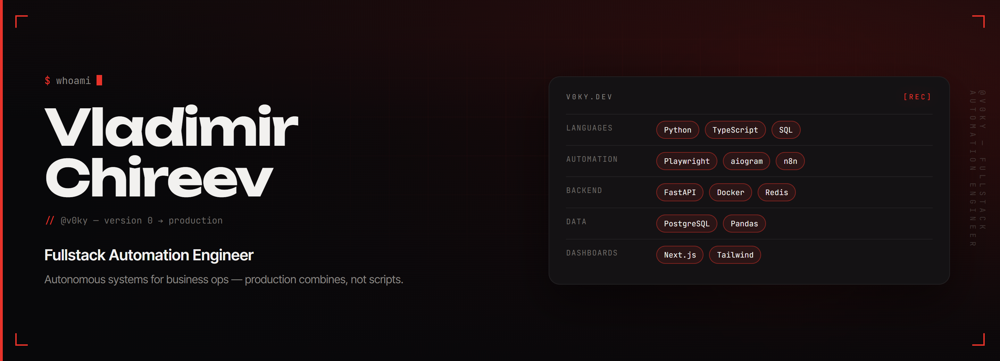

  

 

**Fullstack Automation Engineer.** I design and ship autonomous systems for businesses — production machines that take over an operation end-to-end: collect, decide, act, log, alert. Not scripts. Combines.

Freelance since 2018. **150+** turnkey projects; on [Kwork](https://kwork.com/user/v0kyyy) — **126** delivered orders, **72** reviews, **100%** success / on-time, **48%** repeat clients.

---

### What I build

I work with companies whose operations still live in tabs, chats, and spreadsheets. The deliverable is a **running system**: queues, retries, monitoring, and a control surface — so a person is not the runtime.

| | |
|---|---|
| **Autonomous systems** | Full production loops for a business process. Watch → decide → act → report. Kill-switches, logs, and SLAs are part of the product, not a later patch. |
| **Combines** | Multi-module machines for one domain: parse, classify, transform, then book / publish / sync. One process, one pipeline, one owner — SMM factories, lead desks, marketplace ops. |
| **System integrations** | CRM, 1C, warehouse, marketplaces, messengers, payments as an event bus. Stock, money, and deals stay in lockstep; mismatches go to an exception queue, not a chat. |
| **High-load automation** | Async workers, Playwright at volume, proxy rotation, self-healing jobs. Speed paths where seconds decide the outcome — slots, listings, drops. |
| **Operator surfaces** | Dashboards and Telegram desks the owner actually opens: live metrics, alerts when a KPI leaves the band, enough context to act. |

### Selected work

- [v0ky.dev](https://v0ky.dev) — case studies of automation systems shipped for businesses

<!-- Next pins:
- [repo](https://github.com/v0kyyy/repo) — problem + result
-->
